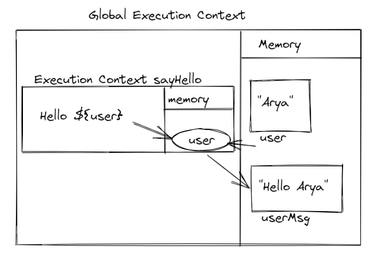
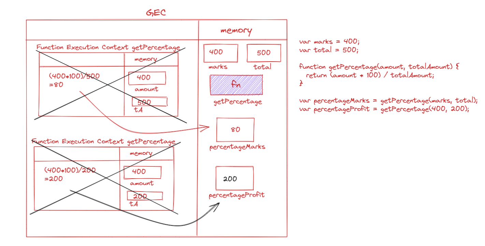
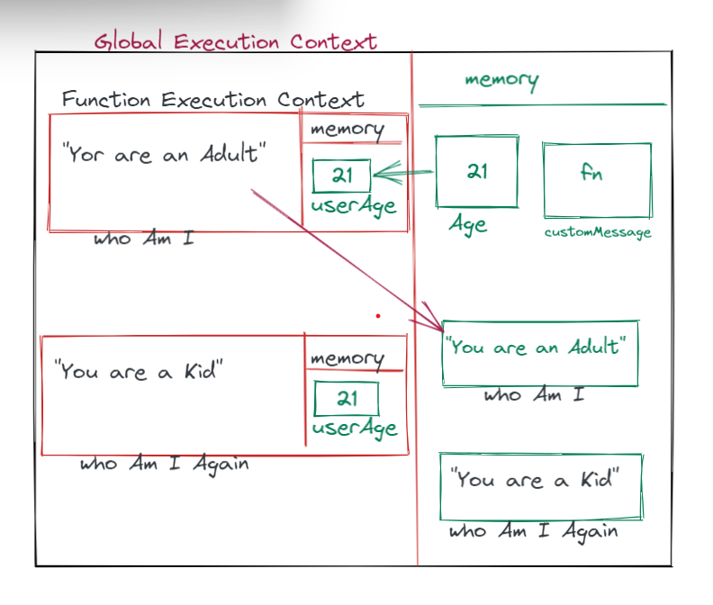

1. What does thread of execution means in JavaScript?

Whenever a piece of code is executed line by line in JavaScript, it is known as thread of execution

2. Where the JavaScript code gets executed?

JavaScript code gets executed in JavaScript engine.

3. What does context means in Global Execution Context?

The context is the environment in which a code gets executed.

4. When do you create a global execution context.

As soon as a code snippet is created JavaScript creates a global execution context.

5. Execution context consists of what all things?

Contains a specific section used for storing data also known as memory and a section for computation i.e. execution.

6. What are the different types of execution context?

Global execution context and function execution context.

7. When global and function execution context gets created?

Global execution context is created only once for a program, function execution context is created in global execution context as many times a function is created.

8. Function execution gets created during function execution or while declaring a function.

Function execution context is created while executing a function.

9. Create a execution context diagram of the following code on your notebook. Take a screenshot/photo and store it in the folder named `img`. Use `` to display it here.


```js
var user = "Arya";

function sayHello(){
  return `Hello ${user}`;
}

var userMsg = sayHello(user);
```

<!-- Put your image here -->




```js
var marks = 400;
var total = 500;

function getPercentage(amount, totalAmount){
  return (amount * 100) / totalAmount;
}

var percentageMarks = getPercentage(marks, total);
var percentageProfit = getPercentage(400, 200);
```

<!-- Put your image here -->




```js
var age = 21;

function customeMessage(userAge){
  if(userAge > 18){
    return `You are an adult`;
  }else {
    return `You are a kid`;
  }
}

var whoAmI = customeMessage(age);
var whoAmIAgain = customeMessage(12);
```

<!-- Put your image here -->

